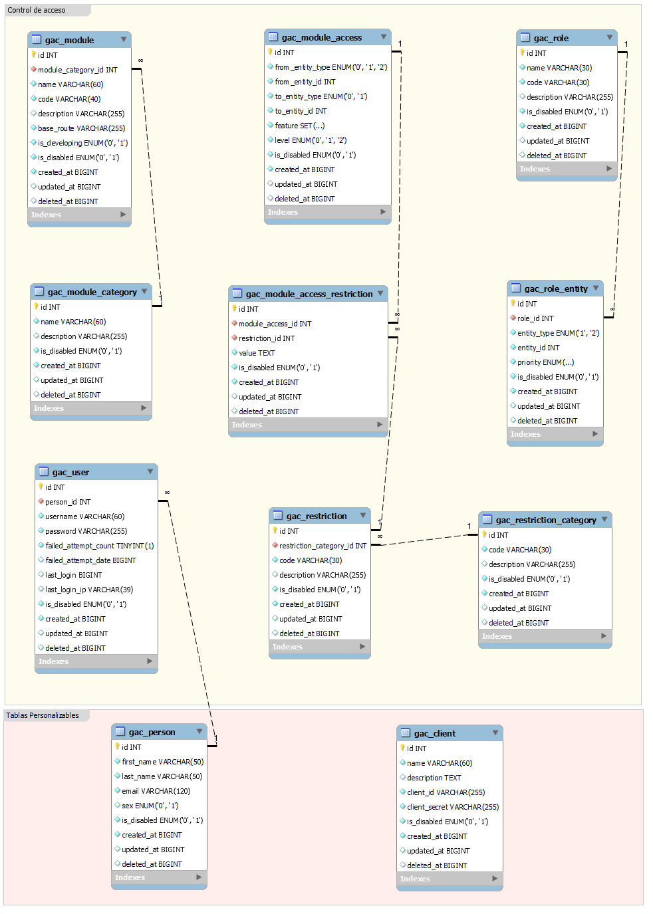

# GAC - Granular Access Control

**GAC** (Granular Access Control) es una librería PHP que proporciona un sistema flexible y eficiente para gestionar los permisos de acceso en desarrollos backend (APIs, MVC, Etc).

**Características:**

-  **Control de acceso granular:** Permite definir permisos detallados a nivel de módulo, caracteristicas y restricciones.
- **Restricciones flexibles:** Implementa restricciones basadas en fechas, entidades (ejemplo: sucursales) y otros criterios personalizados (ejemplo: restricciones por IP).
- **Integración sencilla:** Conéctate a tu base de datos existente o utiliza una configuración por defecto.
- **Extensible:** Adapta la librería a tus necesidades específicas mediante la creación de nuevos tipos de restricciones y la modificación de los adaptadores de cache y base de datos.
-  **Caché:** Mejora el rendimiento de tu aplicación almacenando en caché los permisos de los usuarios.

## Instalación:
...

**Requerimientos:**
...


## Ejemplo

```php
<?php

use DancasDev\AccessControl\AccessControl;

// Configuración de la conexión a la base de datos
$databaseConfig = [
	'host' => 'localhost',
	'username' => 'root',
	'password' => '',
	'database' => 'gac_table'
];

// Crear una instancia de AccessControl
$accessControl = new  AccessControl($databaseConfig);

// Cargar los permisos del usuario
$hasPermissions = $accessControl->loadPermissions('user', 1);
if(!$hasPermissions) {
	exit('Sin permisos.');
}

// Verificar si el usuario tiene permiso para acceder al módulo "users"
$hasPermission = $accessControl->hasPermission('users');
if(!$hasPermission) {
	exit('Sin permiso para el módulo "users".');
}

// Obtener el objeto Permission
$permission = $accessControl->getPermission('users');

// ...
?>
```

## Validación de características

Para verificar si un usuario tiene permiso para realizar una determinada acción (característica) sobre un recurso, puedes utilizar el método `hasFeature()` del objeto `Permission`.

```php
// Verificar si el usuario tiene permiso para leer un recurso
if ($permission->hasFeature('read')) {
    // El usuario tiene permiso para leer
}
```
Puedes pasar un array de características para verificar si el usuario tiene permiso para todas ellas:

```php
// Verificar si el usuario tiene permiso para leer y acceder a la papelera
if ($permission->hasFeature(['read', 'trash'])) {
	// El usuario tiene ambos permisos
}
```
Cada característica se representa por un valor numérico para facilitar el almacenamiento y la comparación en la base de datos, algunas características pueden combinarse, como "trash" (4) con "read" (1), "update" (2) o "delete" (3). Puedes personalizar esta lista y agregar nuevas características según las necesidades de tu aplicación.

| Código | Valor | Descripción                                                   |
|--------|-------------|---------------------------------------------------------------|
| create | 0           | Permiso para crear nuevos registros.                          |
| read   | 1           | Permiso para ver los registros existentes.                    |
| update | 2           | Permiso para modificar registros existentes.                  |
| delete | 3           | Permiso para eliminar registros.                              |
| trash  | 4           | Permiso para acceder a la papelera (combinable con 1, 2 y 3). |
| dev    | 5           | Permiso para acceder a funcionalidades en desarrollo.         |

## Validación de restricciones

La librería permite definir restricciones sobre los permisos, como restricciones de entidad y fecha.

**Ejemplo de validación de restricciones por entidad:**
```php
if ($permission->hasRestriction('branch')) {
    // El usuario tiene una restricción por surcusal
    $currentBranchList = ['1'];
    if($permission ->validateEntityRestriction('branch', $currentBranchList)) {
	    // El usuario tiene permiso para acceder a la sucursal "1" en el módulo en cuestion.
    }
    else {
	    // El usuario no tiene permiso.
    }
}
```

**Ejemplo de validación de restricciones por fecha:**
```php
if ($permission->hasRestriction('date')) {
    // El usuario tiene una restricción por fecha
    $currentUnixTime = time();
    if($permission ->validateDateRestriction($currentUnixTime)) {
	    // El usuario tiene permiso para acceder "hoy" en el módulo en cuestion.
    }
    else {
	    // El usuario no tiene permiso.
    }
}
```

## Estructura de la base de datos:

La librería utiliza una base de datos relacional para almacenar la información de los permisos, usuarios, roles y otras entidades. A continuación se presenta una descripción simplificada de las tablas principales:

-  **acc_module:** Almacena la información de los módulos del sistema.
-  **acc_module_category:** Almacena las categorías de los módulos.
-  **acc_module_access:** Almacena los permisos asignados a usuarios, roles o tokens externos.
-  **acc_role:** Almacena la información de los roles.
-  **acc_role_entity:** Almacena la relación entre roles y usuarios/tokens externos.
-  **acc_user:** Almacena la información de los usuarios.
-  **acc_restriction:** Almacena los tipos de restricciones.
-  **acc_restriction_category:** Almacena las categorías de restricciones.
-  **acc_module_access_restriction:** Almacena las restricciones asociadas a los permisos.



**Relaciones entre las tablas:**

- Un usuario puede tener varios roles.
- Un rol puede tener múltiples permisos.
- Los permisos pueden tener restricciones.

**Comentarios:**

 -  La estructura exacta de la base de datos puede variar según la configuración y las necesidades específicas de tu aplicación.
 - Se aplica la priorización de roles para deducir los permisos.
 - Los permisos personales (usuario o token externo) tienen prioridad sobre los permisos de los roles.
 - Al momento de ejecutar las restricciones solo se tomara un tipo de restricción por categoria.

## Contribución:

Las contribuciones son bienvenidas.